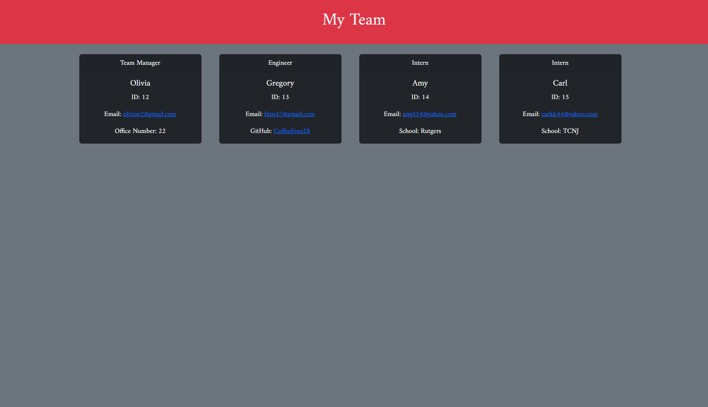

# Team-Data-Base

# MIT

## MIT License 
 

# User Story 
As A manager
 
I WANT to generate a webpage that displays my team's basic info
 
SO THAT I have quick acess to their emails and GitHub profiles 

# Table of Contents
- [Team-Data-Base](#team-data-base)
- [MIT](#mit)
  - [MIT License](#mit-license)
- [User Story](#user-story)
- [Table of Contents](#table-of-contents)
- [Description](#description)
- [Technologies Used](#technologies-used)
- [Installation](#installation)
- [Test](#test)
- [Usage](#usage)
- [Webpage Sample](#webpage-sample)
- [Questions](#questions)

# Description

Command line based program that allows users to input their teams basic info and generate a webpage to display it. 

# Technologies Used
- JavaScript
- Node.js
- Inquirer 
- HTML5
- Bootstrap 
  

# Installation 
This program requires Node.js & Inquirer! 
 
Please run the following command to install the required dependencies: 
<pre><code> npm install </code></pre>

# Test
To test the programs funtionality please run the following command: 
<pre><code> npm test </code></pre>

# Usage
The following video will demonstrate the programs functionality: 

[TeamdatabaseWalkthrough.webm](https://user-images.githubusercontent.com/106839365/187513581-c924fc6d-0ebd-4a03-9f8b-d24012f15192.webm)

# Webpage Sample 

# Questions 
Any questions regarding this repository please open an issue, or reach out to me directly via <a href="https://github.com/CoffeeEyes28">GitHub</a> or by email @ <a href="mailto:litm47@gmail.com">litm47@gmail.com</a>
